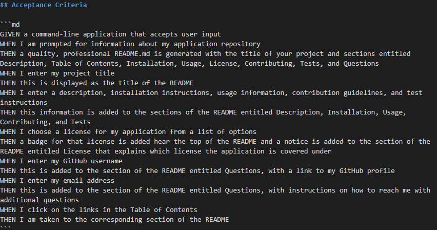

# README Generator

## Description
The README Generator is a command-line application that makes it easier for you to produce a professional looking Readme.md file. 

## Table of Contents
* [Directions](#directions)
* [Video](#video)
* [Takeaways](#takeaways)
* [Acceptance](#acceptance)

## Directions

The first step is to clone this repository onto your computer. Once cloned, you'll need to install npm inquirer via your command terminal. 

To begin, open your command terminal and type **node index.js**. You'll then be prompted with a series of questions. Answer all of them thoroughly as possible. These answers will be incorporated into your README.

Once you've answered all the questions, a "TestReadme" markdown file will be generated in your repository.

## Video Tutorial
Click the link below to watch a video tutorial.

## Takeaways
This activity was very informative. The main focus of this assignment was to learn how to use Node.js. After completing this assignment, I feel confident in my skills in regards to Node and will likely continue to use it throughout the rest of my coding career. I also gained a better understanding of how to utilize multiple js files at the same time. 

## Acceptance

The following screenshot shows the acceptance criteria for this project.

